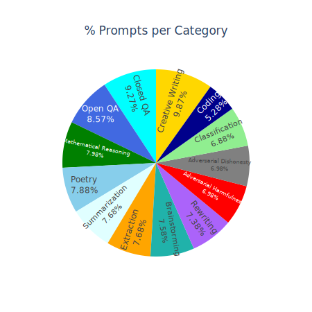
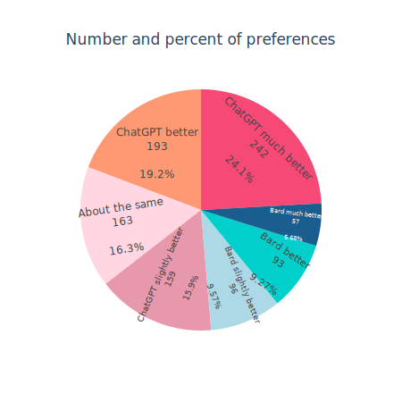
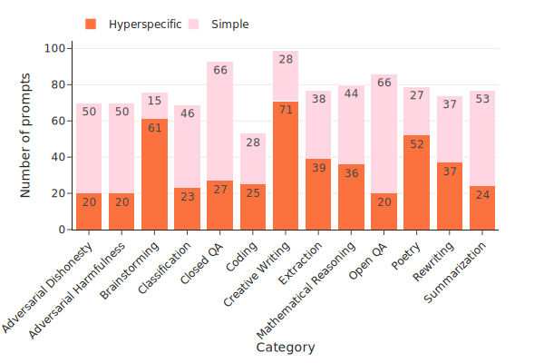
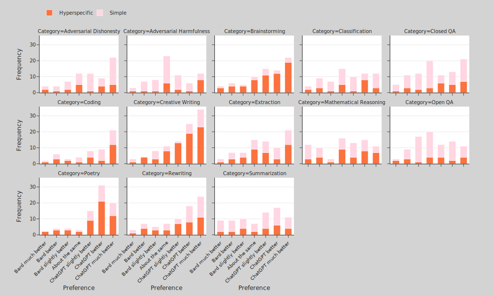
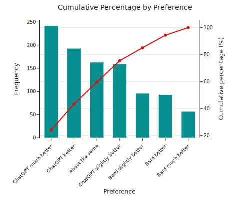
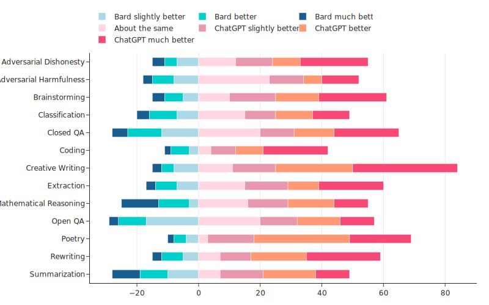
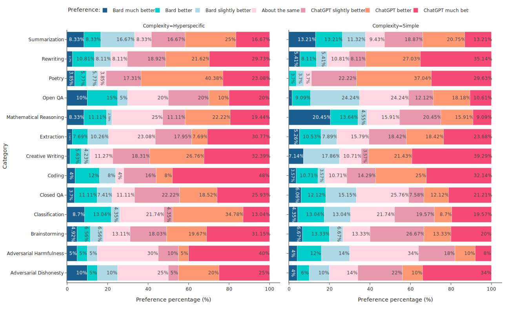

# AI Analytics - Comparing Performance of GenAI Models 

This repository was created to compare the performance of foundational models at different tasks and levels of complexity, using visualisation and statistics.

**Data**:

Data was facilitated by [DataAnnotationTech](https://www.dataannotation.tech/) 


**Categories**:
<table>
    <tr>
        <td>1. Adversarial Dishones</td>
        <td>8. Extraction</td>
    </tr>
    <tr>
        <td>2. Adversarial Harmfulness</td>
        <td>9. Mathemathical Reasoning</td>
    </tr>
    <tr>
        <td>3. Brain Storming</td>
        <td>10. Open QA </td>
    </tr>
    <tr>
        <td>4. Classification</td>
        <td>11. Poetry </td>
    </tr>
    <tr>
        <td>5. Closed QA</td>
        <td>12. Rewriting</td>
     </tr>
    <tr>
        <td>6. Creative Writing</td>
        <td>13. Summarization</td>
    </tr>
    <tr>
        <td>7. Coding</td>
     </tr>
    </table>

<br>

**Likertype rating scale**:

1. Bard much better
2. Bard better
3. Bard slightly better
4. About the same
5. ChatGPT slightly better
6. ChatGPT better
7. Chat GPT much better

Tools used: ```pandas```, ```plotly```, ```statsmodels``` and ```scipy``` and ```scikit-posthocs```


## Bard vs ChatGPT

### Statistical comparison**

**Note**: Imbalance dataset, a prime number of prompts 1003, Bard was not rated "Bard much better in the Poetry Category" and "Bard better" in the category Creative Writing for simple prompts.

- Chi-square with Monte Carlo iterations p-value: 0.0001
- Kruskal-Wallis p-value: 6.96E-7
- Multinomila Logistic regression p-value: 0.00015

<center>
<table>
    <tr>
      <td>
      
      </td>
      <td>
      
      </td>
      <td>
      </p>
      </td>
     </tr>
</table>
</center>


 


 <center>
<table>
    <tr>
      <td>
      
      </td>
      <td>
      
      </td>
     </tr>
</table>
</center>

 
